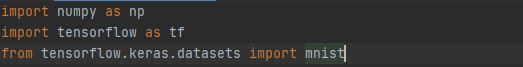
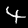
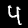
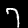
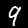
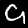
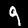
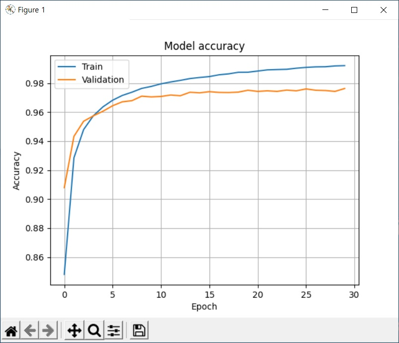
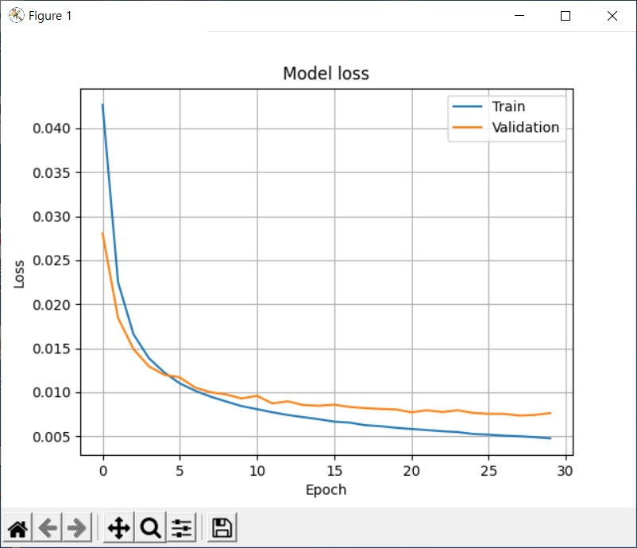

## **텐서플로 프로그램** 

### MNIST 인식

MNIST Image 60000 개의 학습 데이터와 10000 개의 테스트 데이터로 학습 후 인식률을 보여 줍니다.

이 테스트를 위해 다음과 같이 numpy, tensorflow, mnist Library 를 사용 합니다.

### Sample

- 각 숫자별 임의로 5개 추출

### 결과

</img> 
</img> 
