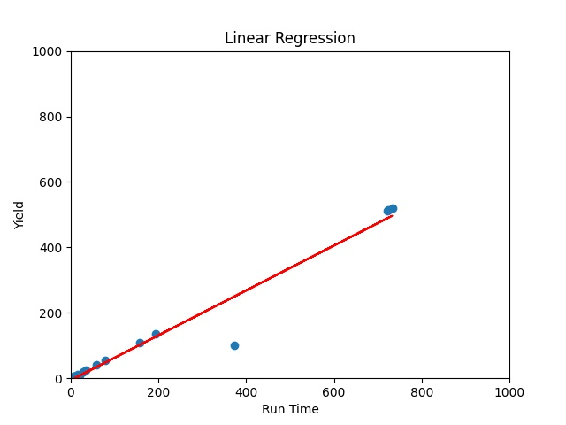

# **산업인공지능개론** 

## 4주차

Durable Rules 패키지를 이용한 프로그램 구성
 
주제를 선정하기에 앞서 먼저 Durable Rules 가 무엇인지 개념을 이해하는 것이 작성에 도움이 될 것 같다.   
Durable Rules 는 규칙기반 시스템 Library 이다.   
즉, 어떤 주제에 대해 Durable Rules Library를 이용하여 규칙을 작성하고 데이터를 입력했을 때   
입력 데이터가 규칙에 부합되는지 아닌지를 판별하여 결과를 출력해 줄 수 있다.   
예를들어 다음과 같이 규칙을 작성한 Code 가 있을 때,   
"물에 산다. 파리를 먹는다. 물에 살고 파리를 먹는 객체는 개구리다. 개구리는 녹색이다."   
위 규칙 조건에 다음과 같이 입력을 준다면   
"케로로는 물에 살고 파리를 먹는다."

케로로는 개구리다. (TRUE)   
케로로는 녹색이다. (TRUE)   

위와 같은 결론이 도출될 수 있으며 입력에 대한 규칙이 작성되어 있지 않을 시 (FALSE) 를 도출한다.

### Alarm Monitor

이 프로그램은 코드에 고정되어 있는 입력 데이터를 조금 더 유연하게 가변적으로 사용하기 위해 파일로부터   
읽어들이고 현재 사용되는 설비에 Alarm 상태 정보를 확인할 수 있도록 작성되었다.

- [Durable Rules](https://github.com/dgyoo-AI/Industrial-AI/tree/main/Programming/산업인공지능개론/4Week-AlarmMonitor)

주제 선정과 입력 데이터를 코드를 수정하지 않고 입력하는 방법에만 중점을 두다보니 Durable Rules 를   
적용하기 위한 규칙이 너무 단순화된 형태로 작성을 한 것 같다.   
그래도 이 경험을 바탕으로 다음에는 보다 쉽게 작성을 할 수 있을 거라는 생각이 든다.

## 9주차

sklearn 이용하여 결과 값 도출하는 프로그램 구성.

이론에있는 개념과 예제들을 보면 이런 원리이구나 하는 감이 눈으로 바로 받아들여진다.   
하지만 막상 그 이론들에 데이터를 입력하기 위한 주제를 찾으려고 하면 생각한 주제가 맞는지   
그 이론에 적용시킬 수 있는 것인지 여러번 생각하게 되고 주제를 찾기가 쉽지 않다.   
이론을 아는 것도 중요하지만 무엇보다 어떤 데이터를 활용할지 판별해내는 것이 더 중요하다.

### 진공 Plazma Chamber 공정 데이터 이상 감지.

Chamber 압력, RF Power, RF Reflect, EPD 에 대한 Time Stamp Data 를 준비하여   
선형회귀 알고리즘을 적용하였다.

- [LinearRegression](https://github.com/dgyoo-AI/Industrial-AI/tree/main/Programming/산업인공지능개론/9Week-LinearRegression)

이해하기 쉽고 유의미한 데이터를 찾으려고 데이터 선정에 많은 고민을 했지만 적합한 데이터를 찾지 못해   
테스트 해볼 수 있는 공정 데이터를 확보하여 간단하게 Code 를 작성했다.   
작성한 후 결과를 보니 학습을 하기 위한 데이터라기 보다 Threshold 를 검출하여 결과값을   
출력해 주는 단순 프로그램으로 이상 검출이 가능하다는 결론이 나왔다.   
데이터 선정에 어려움이 있었지만 어떤 데이터를 선정하여 알고리즘을 적용할지에 대해서 조금은 이해하게 되었다.

## 12주차

CNN 모델(Convolutional Neural Network Models)을 이용한 프로젝트 구성

코드를 작성하기 보다 작성된 코드에 데이터를 끼워 맞춰야하는 프로젝트라 생각이 든다.   
실제로 학습 모델이 수많은 입력 데이터를 학습해야 테스트 데이터가 주어 졌을 때   
결과를 보다 정확하게 출력할 수 있다는 것이 이론의 핵심이다.

### Bird Image 학습 및 인식

학습을 하기 위한 Image 데이터로 앵무새와 머그컵 사진을 준비했다.   
Train Data : 앵무새(120장), 머그컵(120장)   
Test Data : 앵무새(30장), 머그컵(30장)   

- [CNN](https://github.com/dgyoo-AI/Industrial-AI/tree/main/Programming/산업인공지능개론/12Week-CNN_ResNet18)

학습을 하고 결과가 나오기까지 너무 긴 시간이 걸려 Epoch 를 9 까지만 적용하였다.

> ResNet18 사전학습 모델 가중치 O   

구분 | 손실율 | 정확도 
------| ------ | ------
Train | 0.1147 | 0.9417
Test | 0.0003 | 1.0000

> ResNet18 사전학습 모델 가중치 X

구분 | 손실율 | 정확도
------ | ------ | ------   
Train | 0.1534 | 0.9458   
Test | 0.0024 | 1.0000

