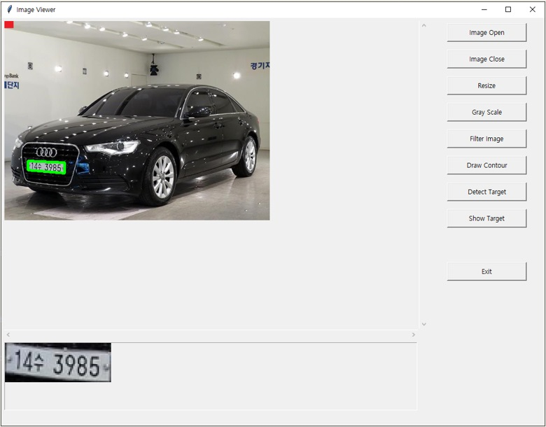

# **산업컴퓨터비전실제** 

## 자동차 번호판 인식 프로그램.

새로운 프로젝트를 할 때마다 항상 어려움을 겪게되는데 이번 주제 또한 선정하기까지 쉽지가 않았다.   
이미 생활속에 자동 차량번호 인식 시스템이 갖추어져 활용되고 있는 분야가 많이 퍼져있다.   
하지만 많이 활용되고 잘 갖추어져 있음에도 인식 오류가 발생하는 것을 자주 목격할 수 있다.   
그래서 이 번호 인식하는 알고리즘을 연구해보고 좀 더 나은 방향으로 개선해보고자 한다.

### 1차 구성

번호판을 인식하기 위해 Image 를 처리하는 단계를 구성하여 인식 오류가 발생할 수 있는 부분을   
찾아내고 그 단계에서 개선 방향을 구상한다.

> import tkinter

옵션 변경 및 적용 결과를 바로 확인하고 Test 해볼 수 있도록 GUI 프로그래밍 관련 내용이 포함된 라이브러리 이다.

> import cv2

image 를 처리하기 위한 대부분의 기능이 포함된 OpenCV 라이브러리 이다.

> import imutils

image Resize 기능을 적용하기 위한 유틸리티 라이브러리 이다.   
cv2 에도 resize 기능이 있으나 다양한 size 의 image 를 일정한 비율로 크기를 조정하기 위해
imutils 의 imutils.resize 를 이용하였다.

> Gray Scale & Filter & Canny Edge

Edge 검출을 위한 전처리 작업으로 color 이미지를 gray scale 로 변환한다.   
그리고 넓은 면적에 나타나는 color 노이즈를 제거할 수 있도록 blur 처리하기 위해 bilateralFilter 를 적용한다.   
다음 단계로 Filtering 된 image 에서 Edge 를 검출하는 cv2.Canny 를 적용하여
결과를 확인한다.

> Detect Contour

검출된 Edge 의 특성들을 확인하기 위해 contour 를 찾아 원본 image 에 그려준다.

> Detect Target

자동차 번호판 영역은 대부분 4 개의 코너를 가지는 cotour 를 가지고 있으므로   
직사각형 영역을 찾는 알고리즘을 적용하여 번호판 영역을 검출한다.

> Show Target

검출된 번호판 영역을 추가 image processing 하기 위해 별도의 image 로 분리하고 보여지도록 한다.

