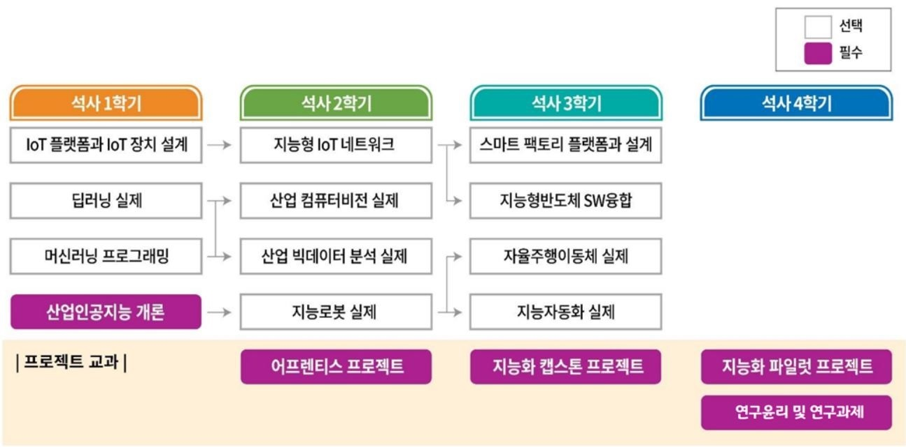

# **Industrial AI** 

## Introduction

2021 학년도 산업인공지능학과 교과 과정에 따른 프로젝트 및 Code 를 게시 합니다.

## Contacts

- 이메일 : [dgyoo@kornic.co.kr](mailto:dgyoo@kornic.co.kr)
- **홈페이지** : [Kornic Automation](https://www.kornic.co.kr)

## Educational Course

### 수행 프로젝트

- `2021-04` [산업인공지능개론](https://github.com/dgyoo-AI/Projects/산업인공지능개론): Python 을 이용한 Mini 프로젝트 구현
- `2021-04` [머신러닝 프로그래밍](https://github.com/dgyoo-AI/Projects/머신러닝프로그래밍): 기계학습 프로그래밍

### AI 관련 프로그래밍

- `2021-04` [산업인공지능개론](https://github.com/dgyoo-AI/Programming/산업인공지능개론): Python 을 이용한 관련 알고리즘 구현
- `2021-04` [머신러닝 프로그래밍](https://github.com/dgyoo-AI/Programming/머신러닝프로그래밍): 기계학습 프로그래밍

### GitHub 교육

- `2021-05` [GitHub이용및포트폴리오작성자료](https://github.com/dgyoo-AI/Industrial-AI): 포트폴리오 관리 자료

### 포트폴리오 현황

- `2021-05` [유대건](https://github.com/dgyoo-AI/Industrial-AI): https://github.com/dgyoo-AI/Industrial-AI

